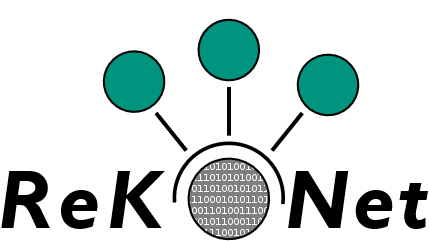

# ReKoNet Dashboard



Dieses Softwaretool dient dazu, verschiedene Möglichkeiten der Allokation von Bauteilen zu simulieren. Durch die Nutzung von Datensätzen und Funktionsmodellen wird sichtbar, wie die Qualität von Produkten durch intelligente Allokation verbessert werden kann. Dabei werden auch Zahlungsbereitschaften evaluiert, die den monetären Wert der Qualität widerspiegeln.

Der vorliegende Code dient als Beispielanwendung. Sofern das Programm über Flask ordentlich gestartet ist, kann im Dashboard zwischen "Dummy" und "Test" ausgewählt werden. 
Dummy stellt einen beispielhaften Datensatz eines Produktes bestehend aus 2 Komponenten mit 3 bzw. 4 funktionskritischen Merkmalen. Das Produkt wird in 3 Funktionsprüfpunkten geprüft, welche mithilfe der Funktionsmodelle prognostiziert werden sollen. 
Test hingegen kann verwendet werden, um zu prüfen, ob der Code ordnungsgemäß funktioniert, hierfür wurde ein spezieller Testdatensatz entwickelt mit unterschiedlich formatierten Merkmalen und einer Edge Cases der Chargen und KLT, sodass die Funktionen der Chargen- und KLT-Allokation geprüft werden können.

Für konkrete Erläuterungen der zugrundliegenden Mechanismen sei auf die nachfolgenden Veröffentlichungen verwiesen:

10.1016/j.procir.2022.10.022

10.1016/j.procir.2021.11.079

10.5445/IR/1000143395


## Ausführen

Um das Projekt auszuführen, werden folgende Programme benötigt:
- Python 3.8 oder höher: [Download](https://www.python.org/downloads/)
- Python IDE: Entweder [PyCharm Professional](https://www.jetbrains.com/de-de/pycharm/download/) oder [Visual Studio Code](https://code.visualstudio.com/Download)


Vor dem *ersten* Start muss zunächst ein Python [Virtual Environment](https://docs.python.org/3/library/venv.html) erstellt werden. Hier können Python-Abhängigkeiten isoliert vom restlichen System installiert werden.
```bash
python3 -m venv rekonet_env
```

Dieses Environment muss jedes Mal beim Öffnen einer neuen Konsole erneut aktiviert werden:
```bash
source rekonet_env/bin/bash
```

Python-Abhängigkeiten installieren:

Standard:
```bash
pip install -e .
```

Im Anschluss kann das erstellte Environment in PyCharm oder VS Code ausgewählt werden, damit die Code-Vorschläge usw. alle Bibliotheken berücksichtigen können.

Projekt ausführen:
`flask run` oder alternativ über die Entwicklungsumgebung.

Webseite aufrufen: http://localhost:5000

Kundenansicht: http://localhost:5000/customer/dummy

Zuliefereransicht: http://localhost:5000/supplier/dummy

## Projektstruktur

```
.
├── .gitignore              # Dateien, die von git ignoriert werden sollen
├── requirements.txt        # Benötigte Python Abhängigkeiten
├── setup.py                # Package-Datei dieser Web-App (wird für pip install -e . verwendet)
├── Current_data            # Verzeichnis der aktuellen Stichproben-Datenauszüge
│   ├── dummy               # Aktueller Datenauszug des dummy-Datensatzes
│   ├── test                # Aktueller Datenauszug des test-Datensatzes
├── app                     # Hauptverzeichnis der Web-App
│   ├── blueprints          # Webseiten Endpunkte (URLs, die aufgerufen werden) und Serverlogik
│   ├── calculations        # Hilfsklassen für diverse Berechnungen (z.B. Faltung)
│   ├── utils               # Sonstige Hilfsklassen
│   ├── templates           # HTML Dateien für das Webseitenlayout (werden vom Server an die Clients gesendet)
│   ├── static              # Sonstige Webdateien
│   │   ├── img             # Bilder und andere Ressourcen
│   │   ├── js              # JavaScript Dateien für die Client-Logik, Plots, usw.
│   │   └── styles          # CSS Dateien für das Webseitendesign
│   └── __init__.py         # Startet den (Python bzw. Flask) Webserver
├── instance                # Benutzerkonfigurierbare Dateien (Einstellungen, ...)
│   ├── data                # Datenauszug, eingesetzt als "Standardcharge"
│   ├── saved_data          # gespeicherte Einstellungen und Datenauszüge, die vom "Customer" hinterlegt werden
│   ├── models              # Funktionsmodelle
│   └── config.json         # Betrachtete Komponenten und Funktionsmerkmale, Funktionsmodell, Toleranzen, Mittelwerte

```

### Erklärung der Projektstruktur
Das Webinterface besteht grundsätzlich aus zwei Teilen:
1. Frontend: der Teil, der im Browser (oder *Client*) ausgeführt wird.
Das Frontend besteht aus einem generellen Aufbau, der in den HTML-Dateien unter app/templates beschrieben wird, einem *Stylesheet*, welches für das Aussehen und Layout der Webseite verantwortlich ist und unter app/static/styles zu finden ist und einer Logik in Form von JavaScript Dateien unter app/static/js.
Die JavaScript Logik ist für das Generieren von Diagrammen, Dropdown-Menüs usw. verantwortlich und sendet bestimmte Anfragen zur Berechnung an den Server.
2. Backend: der Teil, der im Hintergrund in Form eines *Servers* ausgeführt wird. Das Backend läuft entweder auf dem eigenen Rechner (localhost) oder auf einem beliebigen anderen Rechner (cloud).
Beim Aufrufen der Webseite wird zuallererst eine Anfrage vom Browser an den Server geschickt. Jede Anfrage wird dabei von einem *Blueprint* behandelt (zu finden unter app/blueprints). Ein Blueprint ist in Python geschrieben und enthält die Logik, die bei einer Serveranfrage ausgeführt wird.

Die erste Anfrage vom Browser geht also an app/blueprints/index.py, wo im Anschluss die Webseite im HTML-Format zurückgegeben wird.
Dabei werden die Dateien unter app/templates zusammengesetzt. Die verwendeten HTML template-Dateien sind quasi einzelne, unvollständige Bausteine, aus denen eine einzelne Webseite generiert wird.
0_index.html.jinja ist die Datei, die in index.py über `render_template` an den Client gesendet wird. Da die 0_index.html.jinja2 Datei aber von base.html.jinja2 erbt, wird auch alles aus der base Datei in der Serverantwort integriert.
`` gibt dabei an, an welcher Stelle die 0_index Datei in der base Datei "kopiert" werden soll.

Der Server kann außerdem einzelne Variablen oder Informationen dynamisch (also bei einer Client Anfrage) in die template HTML Dateien integrieren. Zu sehen in das in der index Datei an den zwei Arrays `config_types, config_names`, welche vom Server ausgefüllt werden und automatisch die zwei Buttons auf der Webseite generieren. Das erlaubt es, die Templates möglichst allgemein zu halten und alle konkreten Daten aus der Server config.json Datei einzufügen.

Mehr zu den HTML Template Dateien gibt es in der offiziellen Flask Dokumentation nachzulesen: https://flask.palletsprojects.com/en/2.0.x/api/

Die zweite Art von Server Anfragen geht nur indirekt vom Browser, und zwar über die JavaScript Logik aus. Beim Klicken auf z.B. einen Button sorgt die Logik in einer der JavaScript Dateien dafür, dass eine weitere Anfrage an den Server geschickt wird, die dann serverseitig verarbeitet wird und schließlich das Ergebnis einer Berechnung liefert. Mehr zu diesen Anfragen ist im nächsten Kapitel beschrieben. 
## API

Über JavaScript sendet der Browser bestimmte Anfragen an den Python Flask Server, um die Funktionserfüllung, Faltung oder beste Allokation zu berechnen.
Eine Dokumentation der Schnittstellen ist in [API_DOC.md](API_DOC.md) zu finden.

## Erweiterungsmöglichkeiten

Der Administrator soll über eine Oberfläche anpassen können, welche Module es gibt, wie die Semantik ist und wie das Mapping der CSV aussieht (Name der Spalte von Chargen-ID, KLT-ID, Funktionsmerkmale usw. spezifizieren). Dadurch soll das Dashboard auch für künftige Anwendungszwecke und unterschiedliche Komponentenbezeichnungen funktionieren, ohne dass der Code angepasst werden muss.

## Datensouverenität sicherstellen

Es sollte sichergestellt werden, dass für Kunde oder Zulieferer keine vertraulichen Daten des jeweils anderen weitergegeben werden. Beispielsweise könnten in 0_dashboard.html.jinja2 einige Informationen vom Server an den Browser gesendet werden, die eigentlich nicht hätten preisgegeben werden sollen.

Genauso sollte sichergestellt werden, dass in den angezeigten Diagrammen keine vertraulichen Daten bereitgestellt werden.
